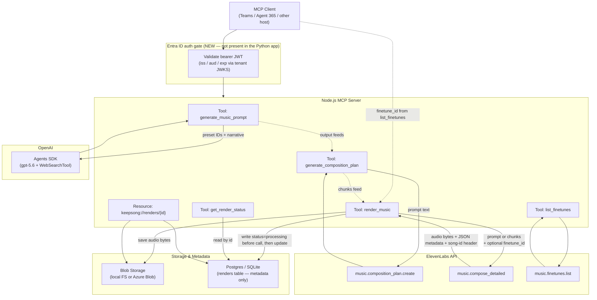

# Keepsong MCP Server Specification (Node.js / TypeScript)

**Source system:** Keepsong FastAPI backend (Python), `c:\Projects\2026\ElevenLabs-music`
**Target system:** A native MCP (Model Context Protocol) server, built in Node.js/TypeScript, exposing the same music-generation pipeline as MCP tools/resources, deployed for Teams/Agent 365 with Entra ID authentication.
**Audience:** A Node.js/TypeScript developer building the MCP server from scratch, without reference back to the Python source.

This document is self-contained. Every data model, service behavior, external API call, and configuration value needed to rebuild the system is described here, including known bugs/workarounds in the current implementation and explicit recommendations for the Node.js port.

---

## 1. Overview

Keepsong is a four-stage AI music generation pipeline:

1. **Prompt** — turns a three-choice preset selection (+ optional freeform narrative) into a polished text prompt for ElevenLabs' `music_v2` model, using an LLM agent with web search.
2. **Plan** — turns a text prompt into a structured, section-by-section composition plan (a `music_v2` "recipe").
3. **Render** — turns a prompt or composition plan into actual audio, via ElevenLabs, with the result persisted to blob storage + a metadata database.
4. **Finetune** — lists ElevenLabs "finetunes" (custom-trained style models) that can optionally steer a render.

These stages are independent HTTP endpoints today (a client can call `/plan` directly, skip `/prompt` entirely, etc.) but are typically chained: `prompt → plan → render`, with `finetune` feeding into `render` as an optional side input at render time.

**Two concepts are easy to confuse and must stay distinct in the Node port:**
- **"Sound Profile"** (`bright_pop_electro`, `dark_trap_night`, `lofi_cozy`, `epic_cinematic`, `indie_live_band`) is a hardcoded, product-defined enum used only by the `/prompt` stage. It has nothing to do with ElevenLabs.
- **"Finetune"** is an ElevenLabs server-side concept (a custom-trained style model, e.g. "Rock Français", "Golden Hour Indie Guitar") selectable only at **render** time via `finetune_id`. It is never part of the prompt or plan stages and is not stored in the composition plan.

**Current security posture: there is no authentication anywhere in the existing system.** Every route is publicly callable; the OpenAI and ElevenLabs API keys are held server-side only. Adding Entra ID auth is entirely new work for the Node MCP server — see [§7](#7-authentication--authorization-entra-id).

---

## 2. Pipeline Architecture & Tool-Flow Diagram



**Typical call sequence:** `generate_music_prompt` → `generate_composition_plan` → (`list_finetunes`, optional) → `render_music` (poll via `get_render_status` if disconnected) → read audio via the `keepsong://renders/{id}` resource or a plain HTTP download/stream route.

Each stage is also independently callable — a client may skip straight to `render_music` with a hand-written prompt or a hand-built composition plan.

---

## 3. Data Models (TypeScript Interfaces)

All source models are Pydantic v2 (Python). Below, each is paired with its direct TypeScript translation. Field-level behaviors that are **not obvious from the type alone** are called out explicitly — porting only the shape and missing these will produce subtly wrong behavior.

### 3.1 Prompt stage (`models/prompt.py`)

```typescript
// Three-choice preset enums — 5 values each, all snake_case string literals.
type ProjectBlueprint =
  | "ad_brand_fast_hook"
  | "podcast_voiceover_loop"
  | "video_game_action_loop"
  | "meditation_sleep"
  | "standalone_song_mini";

type SoundProfile =
  | "bright_pop_electro"
  | "dark_trap_night"
  | "lofi_cozy"
  | "epic_cinematic"
  | "indie_live_band";

type DeliveryAndControl =
  | "exploratory_iterate"
  | "balanced_studio"
  | "blueprint_plan_first"
  | "live_one_take"
  | "isolation_stems";

interface PromptGenerationRequest {
  project_blueprint: ProjectBlueprint;   // required
  sound_profile: SoundProfile;           // required
  delivery_and_control: DeliveryAndControl; // required
  instrumental_only: boolean;            // default false
  user_narrative?: string | null;        // freeform story/occasion/people details
}

// Structured output the LLM agent is constrained to produce.
interface AgentPromptOutput {
  prompt: string;       // the full music_v2 prompt text
  title: string;        // 3-6 words
  description: string;  // 1-2 sentences
}

interface PromptGenerationResponse {
  prompt: string;
  title?: string | null;
  description?: string | null;
  request_id: string;
  timestamp: string;                     // ISO 8601
  input_parameters: PromptGenerationRequest; // echoes the request back
}
```

Zod equivalent for the request (this is what should back the `generate_music_prompt` MCP tool's `inputSchema`):

```typescript
import { z } from "zod";

const ProjectBlueprintSchema = z.enum([
  "ad_brand_fast_hook", "podcast_voiceover_loop", "video_game_action_loop",
  "meditation_sleep", "standalone_song_mini",
]);
const SoundProfileSchema = z.enum([
  "bright_pop_electro", "dark_trap_night", "lofi_cozy",
  "epic_cinematic", "indie_live_band",
]);
const DeliveryAndControlSchema = z.enum([
  "exploratory_iterate", "balanced_studio", "blueprint_plan_first",
  "live_one_take", "isolation_stems",
]);

const PromptGenerationRequestSchema = z.object({
  project_blueprint: ProjectBlueprintSchema,
  sound_profile: SoundProfileSchema,
  delivery_and_control: DeliveryAndControlSchema,
  instrumental_only: z.boolean().default(false),
  user_narrative: z.string().nullish(),
});
```

### 3.2 Plan stage (`models/plan.py`)

```typescript
// A single section of a music_v2 composition plan.
// IMPORTANT: the Python model uses `extra="allow"` — unknown fields (e.g. a
// future `conditioning_ref`, `condition_strength`) are preserved, not dropped.
// The zod schema MUST be `.passthrough()`, not a closed object, or future
// music_v2 fields will silently vanish.
interface Chunk {
  text: string;                    // section marker and/or lyrics, e.g. "[Intro]"; default ""
  positive_styles: string[];       // style descriptors to include; default []
  negative_styles: string[];       // style descriptors to avoid; default []
  duration_ms: number;             // required, no default
  context_adherence?: string | null; // e.g. "high"
  [key: string]: unknown;          // passthrough for any other music_v2 fields
}

interface CompositionPlanResponse {
  chunks: Chunk[]; // default []
}

interface PlanGenerationRequest {
  prompt: string;              // required
  music_length_ms?: number | null; // 1000-300000 (1-300s); if absent, extracted from prompt text or defaulted to 30000
}
```

Zod:

```typescript
const ChunkSchema = z.object({
  text: z.string().default(""),
  positive_styles: z.array(z.string()).default([]),
  negative_styles: z.array(z.string()).default([]),
  duration_ms: z.number().int(),
  context_adherence: z.string().nullish(),
}).passthrough();

const PlanGenerationRequestSchema = z.object({
  prompt: z.string().min(1),
  music_length_ms: z.number().int().min(1000).max(300000).nullish(),
});
```

Note: `models/plan.py` also defines `PlanGenerationResponse` (wraps `plan`/`request_id`/`timestamp`/`input_prompt`/`music_length_ms`), but the actual `/plan` route returns `CompositionPlanResponse` directly — that wrapper type is dead code in the Python app and should **not** be carried into the Node port; just return `{ chunks }` plus whatever envelope (`request_id`, `timestamp`) the MCP tool result wrapper needs.

### 3.3 Render stage (`models/render.py`)

```typescript
interface RenderRequest {
  // --- Generation source: mutually exclusive ---
  prompt?: string | null;
  chunks: Chunk[]; // default []

  // --- Prompt-mode only ---
  music_length_ms?: number | null; // 3000-600000; only valid together with `prompt`

  // --- compose_detailed passthrough params ---
  model_id: string;                 // default "music_v2"
  finetune_id?: string | null;      // works in both prompt and chunks mode
  finetune_strength?: number | null; // 0.0-1.0; only valid together with finetune_id
  force_instrumental: boolean;      // default false
  store_for_inpainting: boolean;    // default false
  with_timestamps: boolean;         // default false
  sign_with_c2pa: boolean;          // default false

  // --- Query-style param ---
  output_format?: string | null;    // e.g. "mp3_44100_128", "pcm_44100"; omit to let API choose

  // --- Local only — NOT sent to ElevenLabs ---
  title?: string | null;            // used only to name the saved output file
}
```

**Validation rules (must be reproduced exactly — currently enforced by a Pydantic `@model_validator`):**
1. Exactly one of `prompt` / `chunks` must be set (both set → error; neither set → error).
2. `music_length_ms` may only be set together with `prompt`.
3. `finetune_strength` may only be set together with `finetune_id`.

Zod equivalent using `superRefine` (Pydantic's `mode="after"` validator has no single-expression zod equivalent, so use a refine step):

```typescript
const RenderRequestSchema = z.object({
  prompt: z.string().nullish(),
  chunks: z.array(ChunkSchema).default([]),
  music_length_ms: z.number().int().min(3000).max(600000).nullish(),
  model_id: z.string().default("music_v2"),
  finetune_id: z.string().nullish(),
  finetune_strength: z.number().min(0).max(1).nullish(),
  force_instrumental: z.boolean().default(false),
  store_for_inpainting: z.boolean().default(false),
  with_timestamps: z.boolean().default(false),
  sign_with_c2pa: z.boolean().default(false),
  output_format: z.string().nullish(),
  title: z.string().nullish(),
}).superRefine((val, ctx) => {
  const hasPrompt = !!(val.prompt && val.prompt.trim());
  const hasChunks = val.chunks.length > 0;
  if (hasPrompt && hasChunks) {
    ctx.addIssue({ code: "custom", message: "Provide either 'prompt' or 'chunks', not both." });
  }
  if (!hasPrompt && !hasChunks) {
    ctx.addIssue({ code: "custom", message: "Provide either 'prompt' or 'chunks'." });
  }
  if (val.music_length_ms != null && !hasPrompt) {
    ctx.addIssue({ code: "custom", message: "'music_length_ms' can only be used together with 'prompt'." });
  }
  if (val.finetune_strength != null && !val.finetune_id) {
    ctx.addIssue({ code: "custom", message: "'finetune_strength' can only be used together with 'finetune_id'." });
  }
});
```

Response:

```typescript
interface RenderResponse {
  id: string;                    // render id — primary handle for status/download/stream
  filename: string;
  file_path?: string | null;     // canonical storage URL/URI (blob URL, or file:// URI locally) — informational only
  download_url: string;          // app-proxied download endpoint
  stream_url?: string | null;    // app-proxied inline-playback endpoint
  content_type: string;          // default "audio/mpeg"
  file_size_bytes: number;
  duration_ms?: number | null;
  composition_plan?: Record<string, unknown> | null; // plan as returned/modified by the API
  song_metadata?: Record<string, unknown> | null;
  request_id: string;
  timestamp: string; // ISO 8601
}
```

`to_compose_kwargs()` — the request-to-API-call mapping (`models/render.py:108-142`) — must be ported as a plain function. Key rules: `output_format` is included only if set (so the API applies its own default); `finetune_id`/`finetune_strength` included only if set; if `prompt` is set, send `{prompt, music_length_ms?}`; otherwise send `{composition_plan: {chunks: [...]}}`. `title` is **never** sent to ElevenLabs.

### 3.4 WebSocket / progress message models (`models/websocket.py`)

These aren't needed verbatim in the Node port (see [§8](#8-mcp-tool--resource-mapping) — progress is remapped onto MCP's native progress-notification mechanism), but the **shape and stage vocabulary** they carry must be preserved since it's what the frontend / any existing client already expects if you keep a compatibility HTTP/WS layer:

```typescript
interface ProgressMessage {
  type: "progress";
  stage: string;             // connected | validating | validated | generating | processing | saving | extracting | complete
  progress_percent: number;  // 0-100
  message: string;
  timestamp: string;
}

interface ResultMessage {
  type: "result";
  data: RenderResponse;
}

interface ErrorMessage {
  type: "error";
  error_code: "VALIDATION_ERROR" | "SERVER_ERROR" | "INVALID_REQUEST";
  message: string;
  timestamp: string;
}
```

### 3.5 Finetune stage (`models/finetune.py`)

```typescript
interface FinetuneSummary {
  id: string;                 // pass as finetune_id to render_music
  name?: string | null;
  tags: string[];              // default []
  primary_genre?: string | null;
  model_id?: string | null;    // e.g. "music_v2"
  created_at?: string | null;  // ISO datetime
  visibility?: "private" | "workspace" | "public" | null;
  created_by?: "self" | "workspace" | "elevenlabs" | null;
  status?: string | null;      // e.g. "completed"
  training_progress?: number | null; // 0.0-1.0
  failure_reason?: string | null;
}
// Python uses `extra="ignore"` here (opposite of Chunk) — unknown fields from
// a future API response are dropped, not preserved. A plain (non-passthrough)
// zod object matches this correctly.

interface FinetuneListResponse {
  finetunes: FinetuneSummary[]; // default []
  count: number;                 // required
  has_more: boolean;             // default false
  next_cursor?: string | null;
}
```

### 3.6 Persisted metadata (`db/models.py` — `renders` table)

```typescript
interface RenderRow {
  id: string;                 // PK, app-generated UUID, varchar(36)
  blob_key: string;           // unique, indexed — storage object key (== filename)
  blob_url?: string | null;
  filename: string;           // indexed
  content_type: string;       // default "audio/mpeg"
  file_size_bytes: number;
  duration_ms?: number | null;
  model_id?: string | null;
  title?: string | null;
  prompt?: string | null;
  mode?: "prompt" | "plan" | null;
  output_format?: string | null;
  composition_plan?: Record<string, unknown> | null; // JSON column
  song_metadata?: Record<string, unknown> | null;    // JSON column
  request_id?: string | null; // indexed
  status: string;             // default "complete" — see §9 for the new "processing"/"failed" states recommended for the Node port
  created_at: string;         // server-default now(), timezone-aware
}
```

Audio bytes never touch this table — only a `blob_key` reference. Note: `finetune_id`/`finetune_strength` used for a render are **not currently persisted anywhere** — this is a gap in the Python app; the Node port should add these two columns since they're relevant provenance.

---

## 4. Service Logic

### 4.1 Prompt generation (`services/prompt_generator.py`)

**Inputs:** `PromptGenerationRequest`. **Output:** `AgentPromptOutput`.

1. Lazily reads the system prompt from `prompts/generate_music_prompt.md` (359 lines — see [Appendix A](#appendix-a-preset-detail-tables-from-generate_music_promptmd) for its full preset content) and caches it in memory. Missing file → `FileNotFoundError`.
2. Lazily builds an OpenAI Agent: `model="gpt-5.6"`, `tools=[WebSearchTool()]`, `output_type=AgentPromptOutput` (forces structured JSON output matching the 3-field schema), and caches the agent instance.
3. Serializes the entire validated request to a JSON string (`request.model_dump_json(indent=2)`) and passes it as the single user message to the agent runner.
4. Iterates returned tool-call items purely for logging (to confirm whether/how `WebSearchTool` was invoked — no side effects).
5. Reads the structured final output; if missing or wrong type → `RuntimeError("Agent returned invalid output")`.
6. Any exception is caught, logged, and re-raised as `RuntimeError(f"Prompt generation failed: {e}")`.

**No retries anywhere.** A `reload_instructions()` dev convenience clears the cached instructions/agent so the markdown file can be hot-edited without restarting — worth keeping as a debug affordance in the Node port but not a production concern.

**Router-level error mapping** (`routers/prompt.py`) for the HTTP app: `FileNotFoundError` → 500 "Configuration Error"; `RuntimeError` → 500 "Generation Error"; anything else → 500 "Internal Server Error". For the MCP tool, map these to MCP tool-error results with the same distinction preserved in the error message (a misconfigured server vs. a generation failure are different failure classes an operator needs to tell apart in logs).

### 4.2 Plan generation (`services/plan_generator.py`)

**Inputs:** `PlanGenerationRequest`. **Output:** `CompositionPlanResponse`.

1. Duration resolution, **in priority order**:
   1. `request.music_length_ms` if explicitly provided.
   2. Else, regex-extracted from the prompt text: pattern `(\d+(\.\d+)?)\s*[-\s]?\s*seconds?` tried first, then `(\d+(\.\d+)?)\s*[-\s]?\s*minutes?` — case-insensitive. Matches things like `"30-second"`, `"30 seconds"`, `"2 minutes"`, `"1.5 minute"`. Result clamped to `[1000, 300000]` ms.
   3. Else, default `30000` ms.
2. Calls ElevenLabs `music.composition_plan.create(prompt, music_length_ms, model_id="music_v2")`.
3. Maps each returned chunk into the `Chunk` shape (`text`, `positive_styles`, `negative_styles`, `duration_ms`, `context_adherence`) — this is a plain field copy, not a transformation.
4. Any exception → `RuntimeError(f"Composition plan generation failed: {e}")`.

**No retries.**

### 4.3 Render (`services/render_service.py`) — the highest-risk stage

**Inputs:** `RenderRequest`. **Output:** a `RenderResult` (id, filename, blob_key, content_type, file_size_bytes, blob_url, duration_ms, composition_plan, song_metadata) — mapped to `RenderResponse` by the caller (router or WS handler), which also assigns `download_url`/`stream_url`.

**Two entry points with identical logic, duplicated in the Python code** (worth unifying in the Node port rather than porting the duplication):
- `render(request) -> RenderResult` — synchronous, blocking, used by the HTTP endpoint.
- `render_with_progress(request, progress_callback) -> RenderResult` — async, used by the WebSocket endpoint; the ElevenLabs call runs in a worker thread while progress is reported to the caller.

**Shared steps (both paths):**

1. `compose_kwargs = to_compose_kwargs(request)` (see §3.3).
2. **If** `chunks`-mode (`"composition_plan" in compose_kwargs`): validate via the rules below. **Prompt-mode requests are not validated here** (ElevenLabs validates prompt-mode itself).
   - Composition-plan validation (`_validate_composition_plan`, `services/render_service.py:57-97`):
     - At least one chunk, or → `ValueError`.
     - Total duration across all chunks must be in `[3000, 600000]` ms, or → `ValueError` with the actual total in the message.
     - Every individual chunk must be ≥ `3000` ms, or → `ValueError` naming the offending chunk's `text` (or its index if `text` is empty).
3. Call ElevenLabs `compose_detailed` — **see the finetune workaround below; this is the step with real engineering risk.**
4. Determine the output filename (== storage key): if `request.title` is set, sanitize it (`_sanitize_filename`, `services/render_service.py:100-111`: lowercase → collapse whitespace to `_` → strip everything not `[\w-]` → truncate to 50 chars → append `_<8 hex chars>.mp3`); otherwise use the filename ElevenLabs itself returned.
5. Determine `content_type` from `output_format` prefix: `mp3*`→`audio/mpeg`, `pcm*`→`audio/pcm`, `opus*`→`audio/opus`, `wav*`→`audio/wav`; anything else (including unset) → `audio/mpeg`.
6. `storage.save(filename, audioBytes, contentType)` → returns a canonical URL/URI.
7. Extract `composition_plan` and `song_metadata` from the response's JSON payload (both optional/nullable).
8. Compute `duration_ms`: sum of `duration_ms` across the **response's** composition plan chunks if present; else sum across the **request's** chunks; else fall back to `request.music_length_ms`.
9. Generate a fresh UUID as the render `id` (independent of anything ElevenLabs returns).

**The finetune / multipart workaround (`_compose`, `services/render_service.py:145-174`) — port this behavior exactly, or verify it's unnecessary in Node before dropping it:**

The installed ElevenLabs Python SDK's `MusicClient.compose_detailed` wrapper method only forwards a fixed, hardcoded subset of parameters to the underlying HTTP call — `finetune_id` and `finetune_strength` land in its `**kwargs` and are **silently discarded**, never reaching the API. When either parameter is present, the Python code bypasses the wrapper entirely and calls the SDK's raw autogenerated client directly (`client.music._raw_client.compose_detailed(**raw_kwargs)`), which:
- Requires renaming `sign_with_c2pa` → `sign_with_c_2_pa` (the raw client's Fern-codegen-mangled parameter name — a Python-SDK-internal artifact, **not** a wire/API concept; the actual ElevenLabs HTTP API almost certainly expects `sign_with_c2pa` untranslated — verify this against the live API/API reference before implementing, don't assume).
- Returns a raw HTTP response object (`r`) that must be parsed with the wrapper's private multipart parser (`music._parse_multipart(r.data)`) to reconstruct the same `track_details`-shaped object the normal path would have returned.
- Requires manually pulling the `song-id` response header into the result object (`result.song_id = r.headers.get("song-id")`), since the raw path doesn't do this automatically.

**For the Node port:** the `@elevenlabs/elevenlabs-js` SDK is generated from the same Fern pipeline as the Python SDK, so the same defect (dropped `finetune_id`/`finetune_strength`) is plausible but unconfirmed. Do not assume either way — write a smoke test against the live API early in implementation that calls `compose_detailed` with a real `finetune_id` through the JS wrapper and inspects whether the finetune actually influenced output / whether the field survives to the request. Ship with a raw-HTTP fallback path (Node's built-in `fetch`, using `await response.formData()` to parse the multipart response — audio bytes + JSON metadata in one payload — and `response.headers.get('song-id')` for the header) ready to use if the wrapper turns out to have the same bug, rather than discovering it after shipping.

**Response shape from `compose_detailed`** (referenced as `track_details` in the Python code): has at least `.filename`, `.audio` (raw bytes), `.json` (dict with optional `composition_plan` / `song_metadata` keys), and (raw-client path only) `.song_id`. The exact full field list isn't enumerated in the Python code (it logs all non-callable public attributes for debugging but doesn't consume most of them) — treat this as "whatever the multipart response contains," and confirm the precise shape against ElevenLabs' current API reference at implementation time.

**Progress stages for `render_with_progress`** (used by the WS path; **the actual code**, not the slightly-stale docstring in `routers/render.py`, is authoritative):

| Stage | Progress % | Notes |
|---|---|---|
| `validating` | 5 | |
| `validated` | 10 | |
| `generating` | 15 → up to 65 (simulated) | Kicks off `compose_detailed` as a background task; while it's still running, polls every 2s and bumps progress by 5 (capped at 65%) — **this is fake progress, not real API progress; ElevenLabs gives no progress callback.** |
| `processing` | → 75 | Steps up by 5 every 0.5s until reaching 75 (this and the following stages measure trivial local work, so the stepping is cosmetic pacing, not real sub-progress) |
| `saving` | → 90 | Audio upload to storage, run off the event loop via a thread since the storage SDK call may be synchronous |
| `extracting` | → 95 | Pulling `composition_plan`/`song_metadata` out of the response JSON |
| `complete` | 100 | Terminal |

**Error handling:** `ValueError` (invalid composition plan) is the only expected/typed error; everything else is an unexpected exception. No retries anywhere in this service.

**A gap worth fixing, not porting forward:** the Python code has no compensation logic if the DB write fails after the blob write succeeds (or vice versa) — a render can produce an orphaned blob with no metadata row. Recommendation for the Node port: write the DB row with `status: "processing"` **before** calling ElevenLabs (see [§9](#9-implementation-notes-complexity-ranking--gotchas)), then update it to `"complete"` (with all the result fields) or `"failed"` afterward — this also directly enables the `get_render_status` MCP tool recovery path.

### 4.4 Finetune listing (`services/finetune_service.py`)

**Inputs:** filter params. **Output:** `FinetuneListResponse`.

1. In-memory TTL cache, `Map`-equivalent keyed on the **upstream** call parameters only: `(visibility, created_by, cursor, page_size)`. TTL from `FINETUNES_CACHE_TTL` env var, default `300` seconds; `0` disables caching entirely. Thread-safety in Python is via a `threading.Lock`; in Node's single-threaded event loop this reduces to "no concurrent-mutation concern," but a shared in-memory `Map` still needs a `force_refresh` bypass and TTL check exactly as below.
2. On a cache miss (or `force_refresh=true`, or TTL disabled), calls ElevenLabs `music.finetunes.list(visibility, created_by, cursor, page_size)`, maps each item to `FinetuneSummary`, and stores the page (with `has_more`/`next_cursor`) under the cache key.
3. **`model_id` and `only_completed` are applied client-side, per request, to the cached page** — they are not part of the cache key and not sent upstream. This means one upstream fetch can serve many different filter combinations without re-fetching. `only_completed` defaults to `true` (drops anything with `status !== "completed"`); the router flips this from its own `include_incomplete` query param (`only_completed = !include_incomplete`).
4. Returns `{ finetunes, count: finetunes.length, has_more, next_cursor }` (`count` reflects the **filtered** count, `has_more`/`next_cursor` reflect the **upstream, unfiltered** page).

**Error handling:** missing API key → `RuntimeError` at construction (mapped to 500 by the router). Any other exception during the upstream call is **not** wrapped — it propagates as-is to the router, which is the one place in the whole app that maps a failure to `502 Bad Gateway` rather than 500 (everywhere else uses 500 for upstream failures). Preserve this 502 distinction in the Node port's error mapping for `list_finetunes` specifically.

---

## 5. ElevenLabs API Integration

Three distinct ElevenLabs SDK/API surfaces are used, all against `model_id="music_v2"`:

| Call | Used by | Params sent | Response consumed |
|---|---|---|---|
| `music.composition_plan.create` | Plan stage | `prompt`, `music_length_ms`, `model_id` | `.chunks[]` (each: `text`, `positive_styles`, `negative_styles`, `duration_ms`, `context_adherence`) |
| `music.compose_detailed` | Render stage | See `to_compose_kwargs()` in §3.3; either `{prompt, music_length_ms?}` or `{composition_plan: {chunks}}`, plus `model_id`, `force_instrumental`, `store_for_inpainting`, `with_timestamps`, `sign_with_c2pa`, optional `output_format`, optional `finetune_id`/`finetune_strength` | `.filename`, `.audio` (bytes), `.json.composition_plan`, `.json.song_metadata`, response header `song-id` |
| `music.finetunes.list` | Finetune stage | `visibility`, `created_by`, `cursor`, `page_size` | `.finetunes[]` (mapped to `FinetuneSummary`), `.has_more`, `.next_cursor` |

**No retry/backoff logic exists anywhere in the current codebase for any of these calls** — every call is a single attempt; any failure propagates as an exception immediately. The Node port is not obligated to add retries, but if it does, this is new behavior beyond parity — call it out as an intentional improvement, not a silent behavior change, if added.

**The one non-obvious integration detail** is the `compose_detailed` finetune-parameter-dropping bug and its raw-client workaround — fully described in §4.3. This is the single highest-risk piece of the entire port.

**Error handling pattern across all three calls:** none of the three service modules catch specific ElevenLabs SDK exception types (e.g., rate-limit vs. auth vs. validation errors are not distinguished) — everything is caught by a blanket `except Exception` and re-raised as a generic `RuntimeError` (plan/render) or left unwrapped (finetune, deliberately, to preserve the 502 mapping). The Node port should decide deliberately whether to keep this coarse-grained handling or add typed error discrimination — the current system does not, so there's no existing behavior to match beyond "don't crash the process."

---

## 6. Storage & Persistence

### 6.1 Storage backend abstraction (`services/storage.py`)

A single interface, two implementations, selected by config:

```typescript
interface StorageBackend {
  save(key: string, data: Buffer, contentType: string): Promise<string>; // returns canonical URL/URI
  openStream(key: string): AsyncIterable<Buffer>; // for streaming a download/playback response
  getBytes(key: string): Promise<Buffer | null>;
  delete(key: string): Promise<void>; // no-op if missing
  exists(key: string): Promise<boolean>;
}
```

- **Local filesystem backend** — base directory from config (default `output/music`, resolved relative to project root). `key` may contain `/` for subdirectories. `save` writes the file and returns a `file://` URI. Streams reads in 8192-byte chunks.
- **Azure Blob backend** — lazy-loads the Azure SDK. **Auth precedence: connection string first (if configured), else account URL + managed identity (`DefaultAzureCredential`).** This precedence matters for the Node port: dev environments typically use a connection string (no `az login` required), while Azure Container Apps production uses managed identity with no stored secret. Container is auto-created on first use (idempotent — swallow "already exists" errors). `save` uploads with `overwrite: true` and the given content type, returns the blob's canonical URL.

**Storage key convention:** the key is simply the output filename (see §4.3's `_sanitize_filename` logic) — no separate ID-based path structure. The same string is used as the DB row's `blob_key`, `filename`, and the storage backend's object key.

**Bytes are always proxied through the app, never redirected.** A `storage_signed_urls` config flag exists in the Python `Settings` class as a documented "future toggle" for redirecting clients to short-lived SAS URLs instead — it is defined but **never implemented or read anywhere in the code**. Treat it as aspirational, not a behavior to replicate; if the Node port wants SAS-redirect behavior, it's new design work, not a port.

### 6.2 Metadata persistence

Single table, `renders` (full schema in §3.6). Async SQLAlchemy in Python; recommend **Drizzle ORM** for Node (see §9) targeting both SQLite (dev) and Postgres (prod) from one schema definition, mirroring the existing dev/prod split.

- **Local dev:** SQLite (`sqlite+aiosqlite:///./data/renders.db` in Python — Node equivalent: a local `.db` file via `better-sqlite3` or `libsql`).
- **Production:** Postgres, always via TLS. The Python code strips libpq-style `?ssl=require` query params from the connection URL and instead passes an explicit SSL context to `asyncpg`, because `asyncpg` doesn't understand the libpq query-param convention. Node's `postgres`/`pg` drivers accept SSL config differently (typically an `ssl: true` or `ssl: { rejectUnauthorized: ... }` option) — the practical requirement to preserve is **"always connect to production Postgres over TLS,"** not the specific URL-normalization mechanism (that's a Python/asyncpg-specific workaround).
- **Migrations:** the Python app uses Alembic, with exactly one migration (`68a008a079ed_create_renders_table.py`) creating the table + its three indexes (`blob_key` unique, `filename`, `request_id`). Migrations are explicitly **never run inside the container at startup** — an out-of-band script (`scripts/init_db.py`) creates the database if missing and runs `alembic upgrade head` before deploy, to avoid concurrent-replica migration races. **Recommendation for Node: `drizzle-kit` migrations, run the same way — out-of-band, pre-deploy, never from container startup.**
- In dev only, the Python app can auto-create tables from the ORM models directly (`create_all=True` when `environment == "development"`) as a shortcut around running migrations locally.

Data-access functions to replicate (`services/render_repository.py`):
- `createRender(result, request, requestId)` — insert a row; `mode` is derived as `"prompt"` if the request had a non-empty `prompt`, else `"plan"`.
- `getById(renderId)`
- `getByFilename(filename)` — most recent match by `created_at desc`; exists only for backward-compat lookups from older clients that only knew the filename, not an id. Optional to port unless legacy-client compatibility matters.
- `listRenders(limit=50, offset=0)` — newest-first; **exists in the Python code but is not exposed by any router today** (no `GET /render` list endpoint). Worth exposing as `resources/list` for the MCP resource template (§8) even though the Python HTTP app never surfaced it.

---

## 7. Authentication & Authorization (Entra ID)

**Current state, confirmed by exhaustive search of the Python codebase: there is no authentication or authorization anywhere.** No API-key header check, no JWT/OAuth, no per-route guard. Every endpoint — including `/render/ws` — is callable by anyone who can reach the host. CORS (`allow_credentials=True`, configurable origin allowlist, `allow_methods=["*"]`, `allow_headers=["*"]`) is the only access-adjacent control, and it is not a security boundary. The only other middleware present is a request-ID tagging middleware for log correlation — explicitly documented as *not* a security control (a client may set its own `X-Request-ID`).

This means **all of the following is new work for the Node MCP server, not a port of existing logic:**

- Validate inbound Entra ID (Azure AD) bearer tokens on every MCP tool call and resource read. Recommended approach: `jose`'s `createRemoteJWKSet` (pointed at the tenant's JWKS endpoint) + `jwtVerify`, checking `iss` (tenant issuer), `aud` (this server's App Registration / Application ID URI), and `exp`. Do this as a layer in front of the MCP transport (`StreamableHTTPServerTransport`), not inside individual tool handlers.
- Do **not** use `@azure/msal-node` for this — that library is for a client *acquiring* tokens (auth-code / client-credentials flows); this server is a *resource server validating inbound* tokens, a different role.
- Do **not** use `passport-azure-ad` — deprecated, unmaintained, and Express-coupled in a way that may not fit the MCP SDK's transport model.
- The upstream API keys (`OPENAI_API_KEY`, `ELEVENLABS_API_KEY`) must remain server-side only, exactly as today — never forwarded to or derivable by MCP clients. The existing `/finetunes` proxy pattern (letting the frontend browse finetunes without ever holding the ElevenLabs key) is the right model to keep: the Node server holds the ElevenLabs key, MCP clients never see it.
- Decide (product/deployment decision, not inferable from the Python code) whether authorization is uniform ("any valid Entra ID token from this tenant can use every tool") or differentiated (e.g., only certain users/groups can call `render_music`, which incurs real ElevenLabs cost, vs. read-only tools like `list_finetunes`). The Python app gives no signal either way since it has no authorization model at all — this is a fresh design decision for the Node server, driven by how it will actually be deployed in Teams/Agent 365.

---

## 8. MCP Tool & Resource Mapping

| # | Operation | MCP name | Type | Maps to (Python) |
|---|---|---|---|---|
| 1 | Prompt generation | `generate_music_prompt` | Tool | `POST /prompt` |
| 2 | Plan generation | `generate_composition_plan` | Tool | `POST /plan` |
| 3 | Render (blocking or progress-streamed) | `render_music` | Tool | `POST /render` **and** `WS /render/ws` (collapsed into one) |
| 4 | Render status recovery | `get_render_status` | Tool (**new** — no Python equivalent) | n/a |
| 5 | List finetunes | `list_finetunes` | Tool | `GET /finetunes` |
| 6 | Fetch rendered audio | `keepsong://renders/{id}` | Resource | `GET /render/download/{id}` + `GET /render/stream/{id}` (collapsed into one) |

### 8.1 `generate_music_prompt`

- **Input schema:** `PromptGenerationRequestSchema` (§3.1).
- **Output:** `PromptGenerationResponse` (§3.1), returned as the tool result content.
- **Errors:** distinguish "system prompt file missing" (server misconfiguration) from "agent failed to produce valid structured output" (generation failure) in the returned error text — operationally these need different fixes.

### 8.2 `generate_composition_plan`

- **Input schema:** `PlanGenerationRequestSchema` (§3.2).
- **Output:** `{ chunks: Chunk[] }` (i.e. `CompositionPlanResponse`).

### 8.3 `render_music` — the tool requiring genuine MCP-specific design, not a 1:1 port

**Input schema:** `RenderRequestSchema` (§3.3) — unchanged whether the caller wants progress or not.

**Design decision: one tool, not two.** The Python app splits this into a blocking HTTP endpoint and a separate WebSocket endpoint purely because HTTP has no native streaming-progress mechanism and WebSocket does. MCP already solves this with its `progressToken` mechanism: if the caller includes a `progressToken` in the request's `_meta`, the server can emit `notifications/progress` events during the call before returning the final result. Map the 8-stage sequence from §4.3 directly onto these notifications (`progress`/`total` = percent/100, `message` = the existing human-readable string). If no `progressToken` is supplied, the tool simply runs to completion and returns the final `RenderResponse` — behaviorally identical to today's plain `POST /render`.

**Durability requirement — do not treat this as optional polish.** Renders can take anywhere from several seconds to a few minutes (the simulated-progress loop polls every 2 seconds while waiting on ElevenLabs, with no fixed upper bound). MCP itself has no mandated per-call timeout, but any real transport in front of it (an HTTP gateway fronting Teams/Agent 365 traffic, in particular) is likely to impose one well under "a few minutes." A render that outlives the client's connection or the gateway's timeout must still be recoverable — hence `get_render_status` (§8.4). Concretely: write the `renders` row with `status: "processing"` **before** calling ElevenLabs (not after, as the current Python code implicitly does by only persisting once a result exists), then update it to `"complete"` or `"failed"` when the call resolves.

**Output:** `RenderResponse` (§3.3).

### 8.4 `get_render_status` (new tool)

- **Input:** `{ render_id: string }`.
- **Output:** the same `RenderResponse` shape if `status: "complete"`, or a lighter `{ id, status: "processing" | "failed", error?: string }` otherwise.
- **Rationale:** lets a client that lost its connection (or whose `render_music` call was gateway-timed-out) recover the eventual result by polling with the id it already received in the initial tool-call acknowledgment, instead of losing the job or double-submitting an expensive render.

### 8.5 `list_finetunes`

- **Input schema:** mirrors the query params of `GET /finetunes` — `model_id?`, `visibility?`, `created_by?`, `include_incomplete? (default false)`, `cursor?`, `page_size? (1-100)`, `refresh? (default false)`.
- **Output:** `FinetuneListResponse` (§3.5).
- **Errors:** preserve the distinction between "service misconfigured" (missing API key) and "upstream ElevenLabs call failed" (map the latter's message clearly, mirroring the Python app's unique-in-the-codebase 502 mapping — see §4.4).

### 8.6 `keepsong://renders/{id}` resource

Collapses `download` (Content-Disposition: attachment) and `stream` (Content-Disposition: inline) into one MCP resource read, since that HTTP-header distinction has no equivalent in MCP's resource model — a resource read returns `blob` (base64) content + `mimeType`, full stop. Resolve `id` against the `renders` table, verify the blob still exists in storage, return the bytes.

**Keep a parallel plain-HTTP passthrough** (e.g. `GET /renders/:id/download`, `GET /renders/:id/stream`, both behind the same Entra ID check) alongside the MCP resource — Teams adaptive cards and any `<audio>`-tag-based playback need an actual fetchable URL, which an MCP resource read alone doesn't provide. This isn't redundant; it's serving two different consumers (MCP tool clients vs. UI surfaces) of the same underlying bytes through the same storage/DB layer.

Also expose `resources/list`, backed by `listRenders()` (§6.2) — the Python app never surfaced this as an endpoint, but MCP resource listing is a natural fit for "browse recent renders without knowing an id in advance," and the underlying repository function already exists to support it.

---

## 9. Configuration & Environment Variables

Split into two groups exactly as the Python app does: values that fail the server at **startup**, and values read **lazily** by whichever service first needs them.

### 9.1 Startup-validated (server refuses to boot if missing/invalid)

| Var | Purpose |
|---|---|
| `OPENAI_API_KEY` | OpenAI Agents SDK auth. Python raises at import time if unset — **the Node port should replicate this hard-fail-fast behavior** (fail loudly at process start, not on first prompt-generation call). |
| Storage config (conditional) | If the storage backend is Azure, either `AZURE_STORAGE_ACCOUNT_URL` or `AZURE_STORAGE_CONNECTION_STRING` must be set, checked at startup — and the Azure client is eagerly constructed at startup (not lazily on first render) specifically so a misconfigured storage backend crashes the process immediately rather than failing the first user-facing render. |

### 9.2 Lazily validated (only checked when the owning service is first used)

| Var | Purpose | Default |
|---|---|---|
| `ELEVENLABS_API_KEY` | ElevenLabs SDK auth — checked independently in three separate service constructors (plan, render, finetune) in the Python code, i.e. three separate client instances / key reads. **Recommendation for Node: consolidate to one shared client instance, validated once**, rather than porting the triplication forward. | — |
| `FINETUNES_CACHE_TTL` | Seconds a fetched finetunes page stays cached; `0` disables caching | `300` |

### 9.3 General application settings

| Var | Default | Notes |
|---|---|---|
| `APP_NAME` | `"fastapi-starter"` | cosmetic |
| `APP_VERSION` | `"1.0.0"` | cosmetic |
| `ENVIRONMENT` | `"development"` | `"development"` \| `"production"`; gates dev-only auto-create-tables behavior |
| `CORS_ORIGINS` | `["http://localhost:3000", "http://localhost:5173", "http://localhost:8000"]` | list; not a security boundary — see §7 |
| `OTEL_ENABLED` | `true` | |
| `OTEL_EXPORTER_ENDPOINT` | `"http://localhost:4317"` | OTLP gRPC |
| `OTEL_SERVICE_NAME` | `"fastapi-app"` | |
| `STORAGE_BACKEND` | `"local"` | `"local"` \| `"azure"` |
| `AZURE_STORAGE_ACCOUNT_URL` | `null` | e.g. `https://<account>.blob.core.windows.net` — used with managed identity |
| `AZURE_STORAGE_CONTAINER` | `"music"` | auto-created on first use if missing |
| `AZURE_STORAGE_CONNECTION_STRING` | `null` | dev-only fallback; takes precedence over managed identity if set |
| `STORAGE_SIGNED_URLS` | `false` | defined but **never implemented** in the Python app — see §6.1; don't treat as a real toggle to port |
| `LOCAL_STORAGE_DIR` | `"output/music"` | filesystem backend base dir, resolved relative to project root |
| `DATABASE_URL` | `"sqlite+aiosqlite:///./data/renders.db"` | dev SQLite; prod uses `postgresql+asyncpg://...` — see §6.2 for the TLS handling caveat |

### 9.4 New for the Node MCP server (no Python equivalent)

- Entra ID tenant ID, expected audience (App Registration / Application ID URI), and JWKS endpoint (or tenant ID alone, if deriving the JWKS URL from a well-known template) — required for the auth layer in §7.
- Whatever the chosen MCP transport needs (e.g. a port/path for `StreamableHTTPServerTransport`).

---

## 10. Testing Strategy

The Python `testing/` directory (13 scripts) is **not a pytest suite** — each file is a standalone script run directly (`uv run python testing/test_X.py`), printing human-readable pass/fail output. There is no CI-integrated automated test runner today; treat this as informal integration/smoke testing, and use it primarily as a source of **known-good request/response payloads** to seed Jest/Vitest fixtures, not as a testing architecture to replicate literally.

### 10.1 What the four "core pipeline" scripts actually exercise (useful as fixtures)

- **`test_prompt_endpoint.py`** — posts `prompt_test_cases.json`'s `"default"` case (and, with `--all`, several named scenarios: Meditation/Wellness, Video Game Action, Podcast Background, etc.) to `POST /prompt`. Parses the returned prompt text for a duration hint and writes `generated_prompt.json` = `{prompt, music_length_ms}` for the next script to consume.
- **`test_plan_endpoint.py`** — prefers the previous script's output; falls back to a static `plan_test_input.json` (`{prompt: "Create a 30-second bright pop-electro ad...", music_length_ms: 30000}`). Also validates that a missing `prompt` and an out-of-range `music_length_ms` (500ms, below the 3000ms floor — note: `PlanGenerationRequest`'s actual floor is 1000ms, but this test uses a value below even that) both return `422`. Writes `generated_comp_plan.json` for the next script.
- **`test_render_endpoint.py`** — the most thorough of the four. `render_test_input.json` holds three named payloads: `"plan_mode"` (a 4-chunk composition plan, title "Indie Sunrise"), `"with_title"` (asserts the returned filename embeds the sanitized title), `"prompt_mode"` (`{title, prompt, music_length_ms: 8000, force_instrumental: true, output_format: "mp3_44100_128", ...}`). Exercises, in order: 404-on-missing-identifier, render-with-title, prompt-mode render, plan-mode render (preferring the chained output from the plan test), then downloads the result via `GET /render/download/{id}`, streams via `GET /render/stream/{id}` (validates first-chunk delivery), and finally validation cases: empty-chunks-and-no-prompt, both-prompt-and-chunks, `music_length_ms`-without-`prompt` — all expecting `422`. Also supports `--finetune-id`/`--finetune-strength` CLI flags to exercise the finetune pass-through path specifically.
- **`test_render_websocket.py`** — connects to `ws://localhost:8000/render/ws`, expects the initial `connected` progress message, sends a `{"type": "render", "composition_plan": {...}}` envelope (same source data as the render test), streams `progress` messages until a terminal `result` or `error`. A second scenario sends an empty-`chunks` plan and asserts an `error` message (not a raw connection drop) is returned with an `error_code`.

### 10.2 Other scripts (lower priority to replicate, but useful references)

- `test_endpoints.py` — smoke test for the non-pipeline routes (`/`, `/health`, `/ready`, `/alive`, request-ID header propagation).
- `test_service_direct.py` / `test_create_comp_plan.py` / `test_render_music.py` — bypass HTTP entirely, call the service classes or the raw ElevenLabs SDK directly (useful for isolating "is this an ElevenLabs API issue or an app logic issue").
- `test_storage_and_db.py` — fully offline: spins up a temp SQLite DB + temp local storage dir, exercises the storage backend and repository functions directly with no server/network involved. **This pattern is worth replicating directly in Node** as a fast, network-free test of the storage abstraction + Drizzle repository functions.
- `test_finetunes_endpoint.py` — `GET /finetunes?model_id=music_v2`, asserts every returned finetune has `status === "completed"` (the default filter).
- `testing/finetunes.json` — a 37-entry static snapshot of real-shaped finetune data (matches `FinetuneSummary` exactly) — directly reusable as a Jest/Vitest mock-data fixture for `list_finetunes` tests without hitting the live API.

### 10.3 Recommended Node.js equivalent

- **Vitest** (or Jest) for unit tests of: `to_compose_kwargs`-equivalent mapping logic, the `RenderRequest` zod `superRefine` validation rules (port the exact validation-error test cases from `test_render_endpoint.py`'s validation section and `test_plan_endpoint.py`'s validation section), the `_sanitize_filename`-equivalent function, the finetune TTL-cache logic (freeze `Date.now()`/use fake timers to test expiry).
- Integration tests against a **live** ElevenLabs sandbox/test account (mirroring what `test_render_music.py`/`test_create_comp_plan.py` do today) should be kept separate from the fast offline suite, since they cost real API credits and require secrets — do not run them in every CI pass.
- Reuse `testing/finetunes.json` and the three `render_test_input.json` payloads (`plan_mode`, `with_title`, `prompt_mode`) verbatim as fixtures — they already represent known-good shapes validated against the live API by the existing scripts.

---

## 11. Implementation Notes, Complexity Ranking & Gotchas

### 11.1 Recommended Node.js / TypeScript libraries

| Concern | Recommendation | Why |
|---|---|---|
| MCP server framework | `@modelcontextprotocol/sdk` | Official TS SDK; zod-native tool schemas; `StreamableHTTPServerTransport` for the Teams/Agent 365 deployment target; built-in `progressToken`/`notifications/progress` support needed for `render_music`. |
| ElevenLabs — plan & finetune calls | `@elevenlabs/elevenlabs-js` | Plain JSON-in/JSON-out calls with no known SDK bugs; official SDK buys type safety. |
| ElevenLabs — `compose_detailed` specifically | Raw HTTP (`fetch` + `response.formData()` for the multipart response, `response.headers.get('song-id')`) by default | The Python SDK wrapper silently drops `finetune_id`/`finetune_strength` — a Fern-codegen artifact the JS SDK (generated from the same pipeline) may share. Verify with a live smoke test before trusting the JS wrapper; ship the raw-HTTP path as the safe default regardless. |
| OpenAI Agents equivalent | `@openai/agents` | Official TypeScript port of the Python Agents SDK — same `Agent`/`run()` primitives, built-in web-search tool, zod `outputType` for structured output ≈ `output_type=AgentPromptOutput`. Near 1:1 port target from the same vendor. |
| ORM / DB | Drizzle (`drizzle-orm` + `drizzle-kit`) | One flat metadata table, needs both SQLite (dev) and Postgres (prod) from a single schema — Drizzle's sweet spot, includes migration tooling. Prisma is heavier than needed for one table; Kysely has no built-in migrations. |
| Azure Blob Storage | `@azure/storage-blob` + `@azure/identity` | Direct equivalent of the Python `azure-storage-blob`/`azure-identity` packages already in use; same connection-string-then-managed-identity auth precedence. |
| Entra ID token validation | `jose` (`createRemoteJWKSet` + `jwtVerify`) | Validating *inbound* bearer tokens as a resource server — not the same job as `@azure/msal-node` (token acquisition) or the deprecated, Express-coupled `passport-azure-ad`. |
| Schema validation | `zod` | Native to `@modelcontextprotocol/sdk`'s `registerTool` input-schema binding. Use `.passthrough()` for `Chunk` to preserve Pydantic's `extra="allow"` behavior. |

### 11.2 Complexity ranking (easiest → hardest to port)

1. **Plan (easiest).** A single JSON-in/JSON-out ElevenLabs call plus a regex-based duration extractor. No SDK gotchas, no multipart handling.
2. **Finetune.** Also a plain JSON call, plus a small stateful TTL cache (`Map` + timestamps) with post-fetch client-side filtering. No auth workaround, no binary data.
3. **Prompt.** Moderate — requires wiring up `@openai/agents` correctly (agent + web-search tool + zod structured output) and porting the 359-line system prompt **verbatim** (content, not logic — paraphrasing it will measurably change output quality, since it's the entire behavioral spec for all 15 presets and 6 conflict-resolution rules). No SDK bugs to route around.
4. **Render (hardest, by a wide margin).** Five distinct sources of risk, all detailed in §4.3: (a) porting the prompt/chunks mutual-exclusivity + duration-bounds validation as a zod `superRefine`; (b) parsing an unusual multipart response (audio bytes + JSON metadata + a custom header) with no established Node precedent to copy — needs live-API verification, not just reading docs; (c) the unproven finetune-parameter SDK bug requiring a raw-HTTP fallback built in from day one; (d) reimplementing the simulated-progress timer (`Promise`/`setInterval` based, racing against the actual API call) if progress notifications are wanted; (e) the storage-write-then-DB-write ordering gap (§4.3, §8.3) that should be deliberately fixed (write `"processing"` first) rather than ported forward as-is.

### 11.3 Straightforward vs. needs-care summary

**Straightforward, low-risk conversions:** enum definitions, all Pydantic models except `Chunk`/`RenderRequest` (which need the passthrough/superRefine treatment respectively), the storage backend interface (clean Protocol → TS interface mapping), the `renders` table schema, the finetune TTL cache, the duration-extraction regexes (JS `RegExp` syntax is close enough to Python's `re` here that the same patterns work with minimal adjustment).

**Needs care, in priority order:** (1) the `compose_detailed` multipart response + finetune workaround — budget real investigation time here, don't assume parity with the JS SDK; (2) verbatim-porting `prompts/generate_music_prompt.md` and confirming `@openai/agents`' structured-output mechanism produces equivalently reliable JSON conformance to the Python Agents SDK's `output_type`; (3) designing the MCP progress-notification mapping and the `get_render_status` durability fallback, since these have no direct Python equivalent to copy and require original design work grounded in MCP's actual capabilities; (4) the Entra ID auth layer, entirely new; (5) deciding the TLS connection approach for production Postgres with whatever Node Postgres driver is chosen, since the Python `asyncpg`-specific URL-normalization workaround doesn't transfer directly — only the underlying requirement ("always TLS in production") does.

---

## Appendix A: Preset detail tables (from `generate_music_prompt.md`)

The full system prompt (`prompts/generate_music_prompt.md`, 359 lines) must be carried into the Node port **verbatim** as the LLM system prompt for `generate_music_prompt` — it is the entire behavioral specification for how preset IDs translate into musical direction, and paraphrasing it is a change in behavior, not just a change in format. The tables below summarize its structure for quick reference; they are not a substitute for the full file.

### A.1 Project Blueprint (`project_blueprint`) — defines use case, duration, and structure

| ID | Use case | Duration | Vocal mode |
|---|---|---|---|
| `ad_brand_fast_hook` | Short-form ad/brand spot | 30s | Flexible (instrumental+VO space, or sung jingle) |
| `podcast_voiceover_loop` | Podcast/voiceover bed | 60s | Instrumental only |
| `video_game_action_loop` | Video game/action scene | 90s | Instrumental only |
| `meditation_sleep` | Meditation/wellness/sleep | Auto length | Instrumental only |
| `standalone_song_mini` | Standalone song | 90s default (overridable by narrative — see rule 2) | Sung lyrics |

### A.2 Sound Profile (`sound_profile`) — defines genre and sonic characteristics

| ID | Genre family | Mood | Tempo | Key |
|---|---|---|---|---|
| `bright_pop_electro` | Electronic/EDM | Euphoric/Uplifting | 110-125 BPM | E major |
| `dark_trap_night` | Hip-Hop/Trap | Dark/Tense | 145-170 BPM (halftime) | A minor |
| `lofi_cozy` | Lo-fi/Chillhop/Ambient | Chill/Cozy | 85-105 BPM | Best-fitting warm key |
| `epic_cinematic` | Cinematic/Orchestral | Epic/Heroic | 110-125 BPM | D minor |
| `indie_live_band` | Indie/Rock/Band | Chill/Cozy w/ lift | 85-105 BPM | Best-fitting key |

### A.3 Delivery & Control (`delivery_and_control`) — defines workflow and output style

| ID | Style mode | Strictness |
|---|---|---|
| `exploratory_iterate` | Exploratory | Light constraints, evocative keywords |
| `balanced_studio` | Balanced (recommended default) | Clear constraints without over-prescribing |
| `blueprint_plan_first` | Blueprint (most structured) | High constraints, explicit timing cues in prose |
| `live_one_take` | Performance-forward | Medium, emphasizes human feel |
| `isolation_stems` | Precision (max control) | High, designed for cleanly separable/regeneratable parts |

### A.4 Defaults (when a required key is missing or unrecognized)

`project_blueprint: podcast_voiceover_loop`, `sound_profile: lofi_cozy`, `delivery_and_control: balanced_studio`.

### A.5 Key conflict-resolution rules (6 total — see full file for exact wording)

1. `instrumental_only: true` forces instrumental and strips all sung-lyrics references, regardless of other settings.
2. For `standalone_song_mini` **only**: a target length stated in `user_narrative` (e.g. "about 30 seconds") overrides the 90s default and rescales the structure/vocal-entry timing accordingly.
3. The blueprint's `vocal_mode` is authoritative unless explicitly overridden by rule 1.
4. If vocals are disabled but the sound profile implies a vocal lead, the lead instrument substitutes accordingly (electronic→synth, band→guitar, minimal→piano, cinematic→strings/orchestral motif).
5. The delivery preset controls how much explicit structure/timing detail appears in the final prompt text.
6. If `user_narrative` is provided, it is **mandatory primary creative context**, not optional flavor — including a requirement to use the agent's web-search tool to fetch and incorporate any URLs found in the narrative, with explicit privacy guardrails (omit/generalize sensitive personal data; never invent facts beyond what the user stated).

## Appendix B: Open questions to verify against live APIs before implementation

- **`sign_with_c2pa` wire parameter name** — confirm the actual ElevenLabs HTTP API field name directly against current API documentation/a live call. The Python code's `sign_with_c_2_pa` is a Python-SDK-internal Fern-codegen artifact; do not assume the JS side has (or needs) an equivalent translation.
- **Does `@elevenlabs/elevenlabs-js`'s `compose_detailed` wrapper forward `finetune_id`/`finetune_strength` correctly?** Unconfirmed — the Python wrapper does not. Test directly; build the raw-HTTP fallback regardless (§4.3, §11.1).
- **Exact multipart response shape of `compose_detailed`** — the Python code only documents the fields it actually consumes (`filename`, `audio`, `json.composition_plan`, `json.song_metadata`, `song-id` header); confirm the complete field set against current ElevenLabs API docs so nothing needed later (e.g. word-level timestamps when `with_timestamps: true`) is missed.
- **`PlanGenerationRequest.music_length_ms` floor discrepancy** — the Pydantic model enforces `ge=1000`, but `test_plan_endpoint.py`'s validation test uses `500` expecting a `422` (which would pass either way, but confirm `1000` is the intended floor, not `3000`, before hardcoding it into the Node zod schema — `RenderRequest.music_length_ms` separately uses a `3000` floor, and it would be easy to conflate the two).
